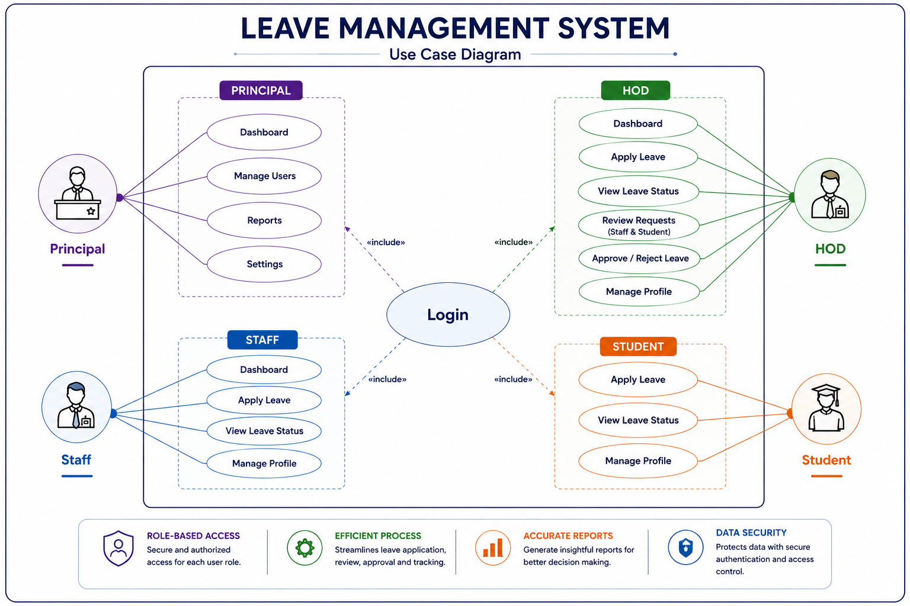
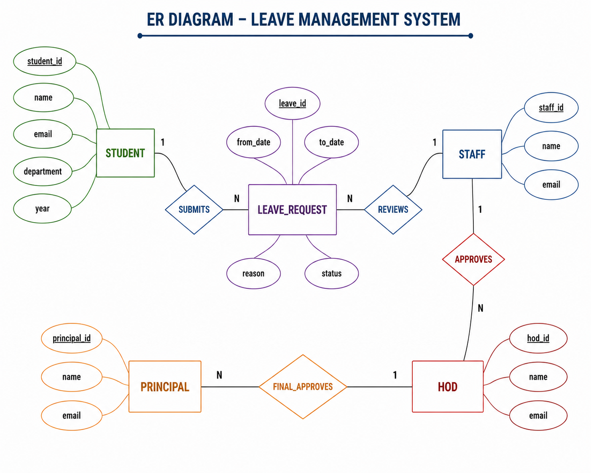

# Leave Management System

## Project Overview

🔸The Leave Management System is a web-based application designed to help students submit leave requests and enable faculty members or administrators to manage them efficiently. The system facilitates leave application, approval, rejection, and leave record management.

## Problem Statement

🔸Many educational institutions manage student leave requests through paper forms or manual records, which can lead to delays, misplaced applications, and difficulties in tracking leave history. A centralized leave management system is needed to efficiently manage and monitor student leave requests.

## Project Objectives

🔸 Provide a centralized platform for managing student leave requests.

🔸 Allow students to apply for and track leave status.

🔸 Enable faculty members/admins to approve or reject leave applications.

🔸 Maintain accurate leave records and history.

🔸 Reduce paperwork and manual processing.

🔸 Improve communication between students and faculty regarding leave requests.

## User Roles

🔸 Principal
🔸 HOD
🔸 Staff
🔸 Student

## Module List

### Dashboard
🔸Provides an overview of leave requests, approvals, and system activities.

### Leave Management
🔸Allows users to apply for leave and track leave status.

### User Management
🔸Manages user accounts, roles, and access permissions.

### Profile Management
🔸Enables users to view and update their personal information.

### Settings
🔸Allows configuration of system preferences and management options.

### Reports (Future Enhancement)
🔸Generates reports and analytics related to leave records and user activities.

## Use Case Diagram

🔸The use case diagram below shows the major actors and functionalities of the Leave Management System.

## Table List

| Table Name | Purpose |
|------------|---------|
| Users | Stores login and user information for Student, Staff, HOD, and Principal |
| Leave_Requests | Stores leave application details submitted by users |
| Leave_Approvals | Tracks approval or rejection status at different levels |
| Roles | Stores user role information and permissions |
| Departments | Stores department details for users |
| Notifications | Stores system notifications and leave status updates |

# ER Diagram

## Description

This ER Diagram represents the database structure of the Leave Management System. It shows the relationship between Student, Staff, HOD, Principal, and Leave Request entities.

## Diagram

